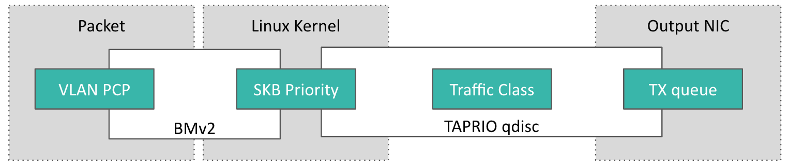

# A P4-Programmable Software TSN Switch for Deterministic Networking

In this post, we present a software TSN switch which is programmable using P4 language to control its behaviour from the data plane at runtime.

# tl;dr - Takeaway Messages

- The Time-Aware Priority shaper (TAPRIO) is one technology to implement the Time-Aware Shaper (TAS) on Linux software bridges.
- Data plane is programable using P4 language
- The combination of TAPRIO qdsic and P4 can provide a flexiblility on TSN

# Motivation

### Motivation for Building a Programmable TSN Switch  

Time-Sensitive Networking (TSN) is a crucial technology for achieving deterministic communication in various domains, including industrial automation, automotive networks, and telecommunications. However, traditional TSN implementations typically rely on hardware-specific devices, limiting their flexibility and adaptability.

To bridge this gap, the Linux kernel has recently integrated several TSN-related features, such as the Time-Aware Traffic Shaper (TAPRIO) qdisc, enabling software-based TSN capabilities. By leveraging these features, it is possible to construct a software-based TSN bridge, as demonstrated in our previous [blog post](https://blog.deterministic6g.eu/posts/2024/11/02/software_tsn_switch.html). However, this software bridge comes with some limitations:

- Cumbersome: It relies on additional components, such as `qdisc` and `tc` filters, to classify traffic, making configuration and management.

- Inflexibility: The bridge's behavior is controlled via the `tc` tool from the control plane, which may introduce delays when rapid traffic adaptation is required.

In this blog post, we introduce a software TSN switch programmable with P4, combining the deterministic features of TSN with the flexibility and programmability of P4-enabled data planes. Our switch is built on Linux’s TAPRIO qdisc, which is essential for traffic shaping in TSN environments. By integrating P4 programmability, the switch enables dynamic traffic management, including real-time packet classification, adaptive scheduling, and in-depth network monitoring. This approach provides a more agile, scalable, and customizable solution for modern deterministic networking needs.


# Background


## TSN

TSN is a set of IEEE 802.1 standards that extend Ethernet to support deterministic communication with bounded latency, low jitter, and minimal packet loss. 

TAS is one of the core components of TSN, defined in IEEE 802.1Qbv, to enable time-division-based scheduling of network traffic by assigning transmission gates to traffic queues, which open and close according to a periodic schedule synchronized across the network. This allows critical traffic to be transmitted at precise time intervals, ensuring predictability.

To have an idea of TSN and TAS, please refer to our [previous post](https://blog.deterministic6g.eu/posts/2024/11/02/software_tsn_switch.html).

## P4: Programming Protocol-independent Packet Processors

Programmable data planes fundamentally change the architecture of network devices by enabling direct control over packet processing logic at the forwarding layer. Unlike traditional fixed-function switches that rely on pre-defined behaviors hardcoded in silicon, programmable data planes allow users to  define how packets are processed directly within the network forwarding hardware or software. 

At the core of this paradigm is, a domain-specific language designed for programming the behavior of the data plane. P4 enables developers to describe how packets are parsed, matched, and modified within a switch or network device in a protocol-agnostic manner. Its core abstractions—such as headers, parsers, match-action tables, and control flow—make it possible to define custom packet processing pipelines. 

P4 programs are compiled to run on a variety of targets, including software switches (e.g., BMv2), programmable hardware switches based on FPGAs, or ASICs. By decoupling packet processing logic from underlying hardware, P4 empowers researchers and network engineers to rapidly prototype and deploy new networking functionalities, thereby accelerating the evolution of modern, intelligent networks.

# A P4-Programmable Software TSN switch

The P4 software switch (BMv2) is the key component, serving as the data plane responsible for packet processing. By utilizing the P4 programming language, the switch allows users to define at runtime how packets are processed, classified, forwarded them to appropriate qdisc ports. This programmability removes the dependency on manual traffic control commands, e.g., `tc`, enabling flexible and runtime adjustments. 


Specifically, we integrate seamlessly the BMv2 with the TAPRIO qdisc by leveraging Linux packet priority. When a packet enters the BMv2, it undergoes a parsing process defined by the P4 program. This parsing step allows users to extract relevant fields from the packet header and perform logical processing as required. For instance, operations like In-band Network Telemetry (INT) can be implemented to monitor the packet's journey through the network, collecting data on latency, jitter, or path utilization. 

After completing the logical processing, the VLAN Priority Code Point (PCP) in the packet header is updated to reflect. Simultaneously, BMv2 updates the `skb->priority` value of the packet in the Linux kernel. The TAPRIO qdisc uses this `skb->priority` value to determine the appropriate traffic class for the packet. The packets of a same traffic class will be sent to the same output transmit (TX) queue, aligning it with the preconfigured time slots defined in the time-aware schedule.


Figure below show how each output packet is classified and attributed to corresponding TX queue based on its PCP:



PCP is a 3-bit value, thus there are maximumally 8 traffic classes. By dynamically changing PCP of a packet, we can control its TX queue, thus shape egress traffic. This approach eliminates the need for static configurations or manual intervention, offering greater flexibility in handling diverse traffic patterns at runtime.


## Environment Setup

In this experimentation, we use Ubuntu 22.04 which is installed inside a Dell laptop.

As we use P4 language to program the switch, we need to install its compiler, `p4c`, and its executor, BMv2:

### P4 compiler

For further information, go [here](https://github.com/p4lang/p4c?tab=readme-ov-file#ubuntu-dependencies)

```bash
source /etc/lsb-release
echo "deb http://download.opensuse.org/repositories/home:/p4lang/xUbuntu_${DISTRIB_RELEASE}/ /" | sudo tee /etc/apt/sources.list.d/home:p4lang.list
curl -fsSL https://download.opensuse.org/repositories/home:p4lang/xUbuntu_${DISTRIB_RELEASE}/Release.key | gpg --dearmor | sudo tee /etc/apt/trusted.gpg.d/home_p4lang.gpg > /dev/null
sudo apt-get update
sudo apt install p4lang-p4c
```


### P4 software switch - BMv2

A pre-compiled version of BMv2 is available [here](https://github.com/p4lang/behavioral-model). However, as we need to patch it to communicate with TAPRIO qdisc via `skb->priority`, we need to install it from source code within our patch.

```bash
# install requirements
sudo apt-get install -y automake cmake libgmp-dev \
    libpcap-dev libboost-dev libboost-test-dev libboost-program-options-dev \
    libboost-system-dev libboost-filesystem-dev libboost-thread-dev \
    libevent-dev libtool flex bison pkg-config g++ libssl-dev
# clone source code
git clone https://github.com/p4lang/behavioral-model.git
# apply our patch
cd behavioral-model
# the latest patch is available here: https://github.com/p4lang/behavioral-model/compare/main...montimage-projects:behavioral-model:main
git checkout 199af48 #same moment we patched BMv2
git apply ../bmv2/bmv2.patch
# compile and install (will take few minutes)
./autogen.sh && ./configure && make -j && sudo make install && cd ..
```

### Testbed

As an example, we will implement a software TSN switch having an input port and an output port to connect a talker and a listener as shown in the following figure.


To implement this testbed in a single machine, we need to isolate the talker and listener inside 2 containers to avoid they connect directly each other. Each container, that is typically a Linux namespace, connects to the TSN switch via a virtual Ethernet link. 
Like a cable, a link acutally has 2 ends. When a packet is sent to an end, it is available on another end.


We first create 2 namespaces, `talker` and `listener`:
```bash
sudo ip netns add talker
sudo ip netns add listener
```

Then create 2 virtual Ethernet links. 

```bash
sudo ip link add veth-ta type veth peer name veth-tb
sudo ip link add veth-la type veth peer name veth-lb
```

We attach one end of each link to its corresponding container.

```bash
sudo ip link set veth-ta netns talker
sudo ip link set veth-la netns listener
```

We must also activate the links by bringing up its ends:

```bash
sudo ip netns exec talker   ip link set veth-ta up
sudo ip netns exec listener ip link set veth-la up
sudo ip link set veth-tb up
sudo ip link set veth-lb up
```

Then set IP addresses for the ends inside `talker` and `listener` namespaces:

```bash
sudo ip netns exec talker   ip address add 10.0.0.1/24 dev veth-ta
sudo ip netns exec listener ip address add 10.0.0.2/24 dev veth-la
```

We also need to disable its offload features which can cause Linux kernel to incorrectly calculcate checksum of packets:

```bash
sudo ip netns exec talker   ethtool --offload veth-ta tx off rx off
sudo ip netns exec listener ethtool --offload veth-la tx off rx off
```


In this demo, we suppose that there are 2 traffic classes, TC0 and TC1 which will be sent into separated 2 TX queues. Thus we need to set number of TX queues to 2:

```bash
sudo ethtool -L veth-lb tx 2
```

Finally, we attach the TAPRIO qdisc to the output port of the switch:

```bash
sudo tc qdisc replace dev veth-lb parent root handle 100 taprio \
     num_tc 2 \
     map 0 1 0 0 0 0 0 0 0 0 0 0 0 0 0 0 \
     queues 1@0 1@1 \
     base-time 1554445635681310809 \
     sched-entry S 01 100000000 sched-entry S 03 50000000 \
     clockid CLOCK_TAI
```

The essensital parameters are as below:

- `num_tc 2`: there are 2 traffic classes
- `map 0 1 0 0 0 0 0 0 0 0 0 0 0 0 0 0`: maps skb priorities 0..15 to a specified traffic class (TC). Specifically,
    - map priority 0 (first bit from the left) to TC0
    - map priority 1 to TC1
    - and priorities 2-15 to TC0 (16 mappings for 16 possible traffic classes).

- `queues 1@0 1@1`: map traffic classes to TX queues of the network device.
 Its values use the format `count@offset`. Specifically,
    - map the firs traffic class (TC0) to 1 queue strating at offset 0 (first queue)
    - map the second traffic class (TC1) to 1 queue starting at offset 1 (second queue)

- `sched-entry S 01 100000000 sched-entry S 03 50000000`: define the intervals, in nanoseconds, during which gates are open or closed. For the first 100ms, only the gate of 1st TX queue is opened. Then the next 50ms, gates of both 1st and 2nd (indicated by the 1st and 2nd bits of `03`) TX queues are opended. This means that, TX queue for TC0 is always available; the one for TC1 is 100 ms unavailable and 50 ms available (cycle time is 150 ms).


## Test

Based on the schedule configured in the TAPRIO qdisc above, we can see that the TC0 packets can be always sent to the egress link, while the TC1 packets can be sent out only during 50 ms for each 150 ms.
This configuration wastes probably egress link's bandwidth when there is only TC1 packets. 

In this test, we will show that TC1 can use the TX queue of TC0 if the TX queue has not used during the last 1 second. For the sake of simplicity, we set TC0 for UDP packets having destination port 1000 and other to TC1. We choose UDP packets rather than TCP to avoid being influenced by TCP congestion algorithm.

The switch's behavior is controlled by [switch.p4](./switch.p4) program. It contains different `control` to parse Ethernet, VLAN, IPv4, UDP protocols; perform a simple packet routing; and adjust dynamically PCP value of a packet.
We do not go into detail all these `control` due the lack of space. Let's just have a look at the most interesting part, PCP adjustment of packets, as shown in the following snippet. 


```P4
//an array having only one element of 48 bits
//  to store timestamp of the most recent packet belong to traffic class 0, TC0
register <bit<48>>(1) last_tc0_packet_ts;

control myEgress(inout headers hdr, inout metadata meta,
                 inout standard_metadata_t std_data) {
    bit<48> ts;
    bit<48> last_ts;
    apply {
        //enable VLAN if it is not existing
        if( ! hdr.vlan.isValid() ){
            hdr.vlan.setValid();
            hdr.vlan.etherType = hdr.ethernet.etherType;
            hdr.ethernet.etherType = TYPE_VLAN;
        }

        @atomic {
            //get ingress timestamp (in microsecond) of the current packet
            ts = std_data.ingress_global_timestamp;
            //dynamically adjust VLAN PCP
            if( hdr.udp.isValid() && hdr.udp.dstPort == 1000 ){
                hdr.vlan.pcp = 0;
                // remember timestamp of the last packet of TC0
                //   to the first element of the array
                last_tc0_packet_ts.write( 0, ts);
            } else {
                // get the timestamp from the first element of the array
                last_tc0_packet_ts.read( last_ts, 0 );
                if( ts - last_ts > 1*1000*1000 )
                    hdr.vlan.pcp = 0;
                else
                    hdr.vlan.pcp = 1;
            }
        }
    }
}
```


We begin by declaring a *global* variable named `last_tc0_packet_ts` to record the ingress timestamp of the most recent TC0 packet observed.

The main logic is implemented inside `apply` block. It first ensures that a VLAN header is present in the output packet. Then, if the current packet is a UDP packet and its destination port is 1000, its PCP field is set to 0, i.e., its traffic class is TC0. For other packet, we compare its ingress timestamp with the timestamp of the last seen TC0 packet. If more than 1 second has passed, the PCP is set to 0; otherwise, it is set to 1. 
The code is enclosed inside an `atomic` block to ensure the `write` and `read` operators of the global variable  are `last_tc0_packet_ts` sequentially executed.

Such a behavior effectively provides a simple, time-based packet prioritization mechanism using programmable data plane features.


We need to compile the P4 code:

```bash
p4c --target  bmv2  --arch  v1model switch.p4
```

Then start the BMv2:

```bash
sudo simple_switch -i 1@veth-tb -i 2@veth-lb switch.json &
```

Start 2 iPerf servers:

```bash
sudo ip netns exec listener iperf3 --server --port 1000 --daemon
sudo ip netns exec listener iperf3 --server --port 2000 --daemon
```

We use tcpdump to capture the output packets of the switch so we can check its traffic shaping:

```bash
sudo ip netns exec listener tcpdump -i veth-la -w trace.pcap --time-stamp-precision=nano --snap 100 tcp or udp &
```

Then start the iPerf clients inside `talker` namespace to generate UDP traffic:

```bash
sudo ip netns exec talker bash -c 'iperf3 --client 10.0.0.2 --port 1000 --udp --time 3 & iperf3 --client 10.0.0.2 --port 2000 --udp --time 5'
```


Stop tcpdump, then plot the traffic shapping:

```bash
python3 ./plot.py
```

We obtain the following figure which shows the arrival time of packets at the listener:


Each packet is drawn by a vertical line. The traffic throughput of each traffic class is 1Mbps with total 789 packets. 

We can see that time-aware shaping is effective and works correctly. During the first 3 seconds, the two traffic classes, TC0 and TC1, are generated at the same time but the latter is available on its timeslots of 50 ms for each 150 ms as we setup in the TAPRIO qdisc above. Once TC0 is ended after 3 seconds, its timeslots are not used while TC1 still continues using its timeslots.
After 1 second, TC1 uses all available timeslots.
 