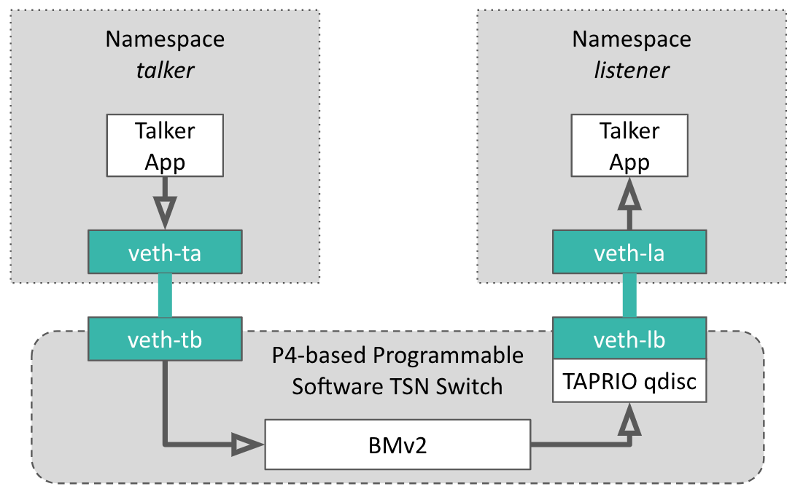

# A P4-Programmable Software TSN Switch for Deterministic Networking

In this post, we present a software TSN switch which can be programmable using P4 language to control the switch's behaviour from the data plane at runtime.

# tl;dr - Takeaway Messages

- The Time-Aware Priority shaper (TAPRIO) is one technology to implement the Time-Aware Shaper (TAS) on Linux software bridges.
- 

# Motivation

### Motivation for Building a Programmable TSN Switch  

Time-Sensitive Networking (TSN) is a crucial technology for achieving deterministic communication in various domains, including industrial automation, automotive networks, and telecommunications. However, traditional TSN implementations typically rely on hardware-specific devices, limiting their flexibility and adaptability.  

To bridge this gap, the Linux kernel has recently integrated several TSN-related features, such as the Time-Aware Traffic Shaper (TAPRIO) qdisc, enabling software-based TSN capabilities. By leveraging these features, it is possible to construct a software-based TSN bridge, as demonstrated in our previous [blog post](https://blog.deterministic6g.eu/posts/2024/11/02/software_tsn_switch.html). However, this software bridge comes with some limitations:

- Cumbersome: It relies on additional components, such as `qdisc` and `tc` filters, to classify traffic based on priority, making configuration and management complex.

- Inflexibility: The bridge's behavior is controlled via the `tc` tool from the control plane, which may introduce delays when rapid traffic adaptation is required.

In this blog post, we introduce a software TSN switch programmable with P4, combining the deterministic features of TSN with the flexibility and programmability of P4-enabled data planes. Our switch is built on Linux’s TAPRIO qdisc, which is essential for traffic shaping in TSN environments. By integrating P4 programmability, the switch enables dynamic traffic management, including real-time packet classification, adaptive scheduling, and in-depth network monitoring. This approach provides a more agile, scalable, and customizable solution for modern deterministic networking needs.


# Background

## TSN

## P4

# A P4-Programmable Software TSN switch

The P4 Virtual Switch (BMv2) is the key component of the switch, serving as the data plane responsible for packet processing. By utilizing the P4 programming language, the switch allows users to define at runtime how packets are processed, classified, forwarded them to appropriate qdisc ports. This programmability removes the dependency on manual traffic control commands, e.g., tc, enabling flexible and runtime adjustments. 


Specifically, the BMv2 virtual switch integrates seamlessly with the TAPRIO qdisc by leveraging Linux packet priority. When a packet enters the BMv2, it undergoes a parsing process defined by the P4 program. This parsing step allows users to extract relevant fields from the packet header and perform logical processing as required. For instance, operations like In-band Network Telemetry (INT) can be implemented to monitor the packet's journey through the network, collecting data on latency, jitter, or path utilization. After completing the logical processing, the VLAN Priority Code Point (PCP) in the packet header is updated to reflect its traffic class or priority. Simultaneously, BMv2 updates the `skb->priority` value of the packet in the Linux kernel. The TAPRIO qdisc uses this priority value to determine the appropriate output queue for the packet, aligning it with the preconfigured time slots defined in the time-aware schedule. By dynamically setting priorities at runtime, this approach eliminates the need for static configurations or manual intervention, offering greater flexibility in handling diverse traffic patterns.


## Environment Setup

In this experimentation, we use Ubuntu 22.04 which is installed inside a virtual machine.

As we use P4 language to program the switch, we need to install its compiler, `p4c`, and its executer, BMv2:

### P4 compiler

For further information, go [here](https://github.com/p4lang/p4c?tab=readme-ov-file#ubuntu-dependencies)

```bash
source /etc/lsb-release
echo "deb http://download.opensuse.org/repositories/home:/p4lang/xUbuntu_${DISTRIB_RELEASE}/ /" | sudo tee /etc/apt/sources.list.d/home:p4lang.list
curl -fsSL https://download.opensuse.org/repositories/home:p4lang/xUbuntu_${DISTRIB_RELEASE}/Release.key | gpg --dearmor | sudo tee /etc/apt/trusted.gpg.d/home_p4lang.gpg > /dev/null
sudo apt-get update
sudo apt install p4lang-p4c
```


### P4 virtual switch - BMv2

A pre-compiled version of BMv2 is available [here](https://github.com/p4lang/behavioral-model). However, we need to patch this switch to communicate with TAPRIO qdisc via `skb->priority`, then we need to install it from source code within our patch.

```bash
# install requirements
sudo apt-get install -y automake cmake libgmp-dev \
    libpcap-dev libboost-dev libboost-test-dev libboost-program-options-dev \
    libboost-system-dev libboost-filesystem-dev libboost-thread-dev \
    libevent-dev libtool flex bison pkg-config g++ libssl-dev
# clone source code
git clone https://github.com/p4lang/behavioral-model.git
# apply our patch
cd behaviral-model
# the latest patch is available here: https://github.com/p4lang/behavioral-model/compare/main...montimage-projects:behavioral-model:main
git checkout 199af48 #same moment we patched BMv2
git apply ../bmv2/bmv2.patch
# compile and install
./autogen.sh && ./configure && make -j && sudo make install
```

### Testbed

As an example, we will implement a virtual switch having an input port and an output port to connect a talker and a listener.



To implement this testbed in a single machine, we isolate talker and listener inside 2 namespaces to avoid they connect directly each other. Each namespace connects to the switch via a virtual Ethernet link. Each link acutally has 2 ends, like a virtual cable.
One end is attached to the container and another end to the P4 virtual switch.


We first create 2 namespaces, `talker` and `listener`:
```bash
sudo ip netns add talker
sudo ip netns add listener
```

Create 2 virtual Ethernet links. 

```bash
sudo ip link add veth-ta type veth peer name veth-tb
sudo ip link add veth-la type veth peer name veth-lb
```

We attach one of of each link to its corresponding container.

```bash
sudo ip link set veth-ta netns talker
sudo ip link set veth-la netns listener
```

We must also bring all interfaces up:

```bash
sudo ip netns exec talker   ip link set veth-ta up
sudo ip netns exec listener ip link set veth-la up
sudo ip link set veth-tb up
sudo ip link set veth-lb up
```

Then set IP addresses for talker and listener:

```bash
sudo ip netns exec talker   ip address add 10.0.0.1/24 dev veth-ta
sudo ip netns exec listener ip address add 10.0.0.2/24 dev veth-la
```

```bash
sudo ip netns exec talker   ethtool --offload veth-ta tx off
sudo ip netns exec listener ethtool --offload veth-la rx off
```

VLAN PCP  -- skb priority -- TAPRIO traffic class -- output TX queue


In this demo, we suppose that there are 2 traffic classes, TC0 and TC1 which will be mapped into 2 output transmit (TX) queues, thus we need to set number of TX queues to 2:

```bash
sudo ethtool -L veth-lb tx 2
```

Finally, we attach the TAPRIO qdisc to the output NIC:

```bash
sudo tc qdisc replace dev veth-lb parent root handle 100 taprio \
     num_tc 2 \
     map 0 1 0 0 0 0 0 0 0 0 0 0 0 0 0 0 \
     queues 1@0 1@1 \
     base-time 1554445635681310809 \
     sched-entry S 01 100000000 sched-entry S 03 50000000 \
     clockid CLOCK_TAI
```

 Change queueing policy

- `num_tc 2`: there are 2 traffic classes
- `map 0 1 0 0 0 0 0 0 0 0 0 0 0 0 0 0`: maps skb priorities 0..15 to a specified traffic class (TC). Specifically,
    - map priority 0 (first bit from the left) to TC0
    - map priority 1 to TC1
    - and priorities 2-15 to TC0 (16 mappings for 16 possible traffic classes).

- `queues 1@0 1@1`: map traffic classes to TX queues of the network device.
 Its values use the format `count@offset`. Specifically,
    - map the firs traffic class (TC0) to 1 queue strating at offset 0 (first queue)
    - map the second traffic class (TC1) to 1 queue starting at offset 1 (second queue)

- `sched-entry S 01 100000000 sched-entry S 03 50000000`: For the first 100ms, only the gate of 1st queue is opened. Then the next 50ms, gates of both 1st and 2nd queues are opended. This means that, TC0 is always open; TC1 is 100 ms closed and 50 ms open (cycle time is 150 ms).

Figure below show how each output packet is classified and attributed to corresponding TX queue based on its PCP:


PCP is a 3-bit value, thus there are maximumally 8 traffic classes.

## Test

We set 2 traffic classes TC0 and TC1 for TCP and UPD packets respectively.

```P4
// an array having only one element of 48 bits
register <bit<48>>(1) last_tcp_packet_ts;

control myIngress(inout headers hdr, inout metadata meta,
                  inout standard_metadata_t std_data) {
    bit<48> ts;
    bit<48> last_ts;
    apply {
        // naif routing
        if( std_data.ingress_port == 1 ){
            std_data.egress_spec = 2;
         } else {
            std_data.egress_spec = 1;
         }

         //enable VLAN if it is not existing
         if( ! hdr.vlan.isValid() ){
             hdr.vlan.setValid();
             hdr.vlan.etherType = hdr.ethernet.etherType;
             hdr.ethernet.etherType = TYPE_VLAN;
         }

         //get ingress timestamp (in microsecond) of the current packet
         ts = std_data.ingress_global_timestamp;
         //dynamically adjust VLAN PCP
         if( hdr.ipv4.protocol == TYPE_TCP ){
             hdr.vlan.pcp = 1;
             // remember timestamp of the last TCP packet
             //   to the first element of the array
             last_tcp_packet_ts.write( 0, ts);
         } else {
             // get the timestamp from the first element of the array
             last_tcp_packet_ts.read( last_ts, 0 );
             if( ts - last_ts > 1*1000*1000 )
                 hdr.vlan.pcp = 1;
             else
                 hdr.vlan.pcp = 0;
         }
    }
}
```

We need to compile the P4 code:

```bash
p4c --target  bmv2  --arch  v1model switch.p4
```

Then start the BMv2:

```bash
sudo simple_switch -i 1@veth-tb -i 2@veth-lb switch.json
```

Start 2 iperf3 servers:

```bash
sudo ip netns exec listener iperf3 -s -p 1000 &
sudo ip netns exec listener iperf3 -s -p 2000 &
```


```bash
sudo ip netns exec listener tcpdump -i veth-la -w trace.pcap --time-stamp-precision=nano --snap 100
```


```bash
sudo ip netns exec talker iperf3 -c 10.0.0.2 -p 1000 -t 4 -b 10M &
sudo ip netns exec talker iperf3 -c 10.0.0.2 -p 2000 -t 4 -b 10M -u